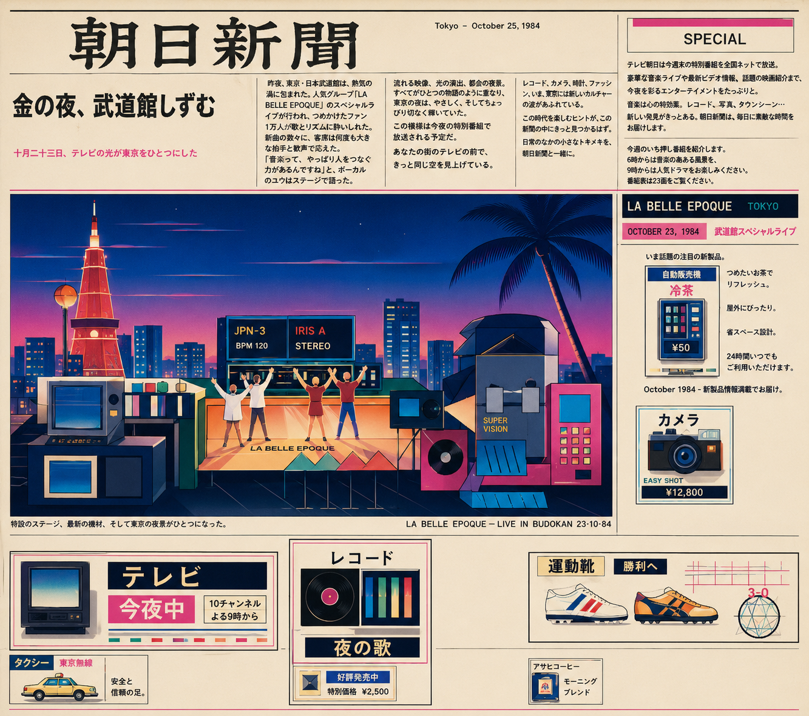
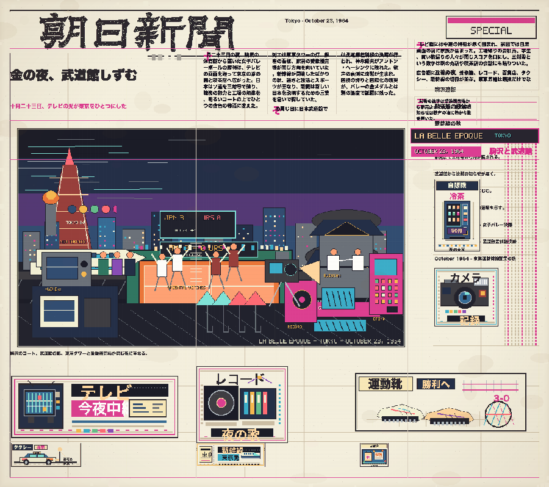

# La Belle Epoque



Pick a country. Pick a date.

La Belle Epoque turns that moment into a retro front page: first as a pixel newspaper, then, if your session supports image generation, as a glossy commercial illustration.

Part archive, part city-pop poster, part nostalgia trip.

## What It Does

This is a Codex skill. Give it a country and a date:

```text
Use $pixel-belle-epoque for Japan on October 23.
```

It researches a date-specific event inside that country's Belle Epoque, creates a pixel-art lead image, builds a country-specific newspaper front page around it, adds live ad sprites, applies a retro print finish, and optionally makes a smooth GPT Image illustration variant.

Supported countries:

- France
- United States
- Japan
- China
- Hong Kong
- Korea

## Gallery

### Stage 2: After Image Generation


### Stage 1: Pixel Newspaper



## Install

Install the dependent skills first:

```text
Use $skill-installer to install pixel-art-creator.
```

Optional, for the final non-pixel illustration variant:

```text
Use $imagegen if it is available in your Codex session.
```

Then install this skill from GitHub:

```text
Use $skill-installer to install git@github.com:Alichua/La-Belle-Epoque.git
```

If your installer needs an HTTPS URL instead:

```text
Use $skill-installer to install https://github.com/Alichua/La-Belle-Epoque
```

Restart Codex after installing skills so the new `$pixel-belle-epoque` skill is picked up.

## Python Dependencies

The bundled renderer scripts use Python 3 and Pillow.

```bash
python3 -m pip install pillow
```

If your environment is managed by `uv`:

```bash
uv pip install pillow
```

The optional GPT Image CLI path belongs to the installed `$imagegen` skill and may require `OPENAI_API_KEY`. The normal pixel newspaper flow does not require that optional final stage.

## Use

Simple:

```text
Use $pixel-belle-epoque for Japan on October 23.
```

Ask for the optional final illustration variant:

```text
Use $pixel-belle-epoque for Japan on October 23. Also create the final commercial illustration variant if image_gen is available.
```

Skip the optional variant:

```text
Use $pixel-belle-epoque for Japan on October 23. Skip the final commercial illustration variant.
```

Try other countries:

```text
Use $pixel-belle-epoque for France on July 1.
Use $pixel-belle-epoque for the United States on April 30.
Use $pixel-belle-epoque for China on October 1.
Use $pixel-belle-epoque for Hong Kong on December 25.
Use $pixel-belle-epoque for Korea on September 17.
```

## Output

The skill writes outputs under:

```text
output/pixel-belle-epoque/<country>-<date>-<event-slug>/
```

Important files:

- `newspaper.png`: final pixel newspaper
- `newspaper-commercial-illustration.png`: optional GPT Image / `image_gen` variant
- `final.png`: lead image before newspaper layout
- `research.md`
- `sources.json`
- `palette.json`
- `newspaper-manifest.json`
- `newspaper-render.json`

## Notes

- The optional final illustration uses the prompt set in `references/final-illustration-prompts.json`.
- In Codex, the image editing surface is usually the built-in `image_gen` tool. The model ID for the fallback CLI path is `gpt-image-2`.
- The skill keeps the original pixel newspaper even when the optional image-generation stage runs.
